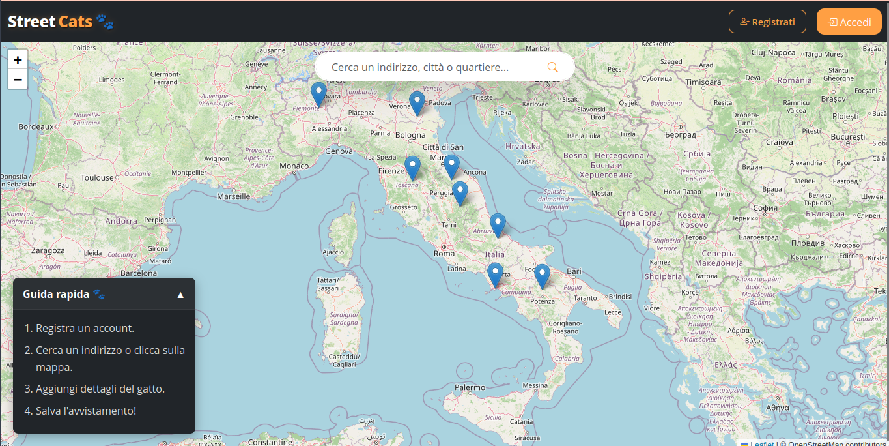

# 🐾 StreetCats - Full-Stack Web Application


**University of Naples Federico II**
*Web Technologies Project | Developed by: Luigi Ariola*
StreetCats is a modern, full-stack Single Page Application designed to report, monitor, and track stray cat sightings on an interactive map.

---

## Tech Stack

- **Frontend:** Angular 19
- **Backend:** Node.js with Express.js framework
- **Database:** PostgreSQL
- **Maps & Geocoding:** Leaflet, OpenStreetMap Tile Layers, and OpenStreetMap Nominatim APIs
- **Styling:** Bootstrap 5

---

## Security Features

The backend implements some security Features

- **Authentication:** Stateless architecture using JSON Web Tokens handled via functional HTTP Interceptors on the client. Passwords are salted and hashed using **bcrypt**.
- **SQL Injection:** Fully prevented by utilizing parameterized queries at the Repository layer.
- **Stored XSS:** Global sanitization middleware that cleanses input payloads before database persistence.
- **Brute Force & DoS:** Strict rate-limiting on the login endpoint (blocks the client IP for 15 minutes after 5 failed attempts).
- **CORS:** Restrictive Cross-Origin Resource Sharing policy based on an allowed origin whitelist.

---

## Automated Testing Suite

The application's stability and resilience are validated continuously through two distinct test suites built with **Playwright** (configured to run on Chromium):

1. **End-to-End Tests (UI):** 10 scenarios simulating real user workflows (both guest and authenticated). It includes asynchronous DOM evaluation to prevent *flaky tests* when interacting with Leaflet dynamic map layers.
2. **API Security Tests:** Simulated cyber-attacks aimed directly at the backend API endpoints to verify the defensive shields (SQLi payloads, Stored XSS scripts, expired/forged JWTs, and rapid connections triggering `429 Too Many Requests`).

---

## Getting Started

### Prerequisites

Make sure you have the following installed locally:

- **Node.js** 
- **PostgreSQL** & **pgAdmin 4**

### 1. Database Setup

1. Open **pgAdmin 4**.
2. Create a new empty database named `streetcats_db`.
3. Open the **Query Tool** for the newly created database.
4. Copy the entire contents of the `backend/src/database/setup.sql` file, paste it into the query editor, and execute the script to build tables and insert test data.

### 2. Backend Configuration & Startup

1. Navigate to the `backend` folder:

   ```bash
   cd backend
   ```

2. Install Dependencies :

   ```bash
   npm install
   ```

3. Rename the .env.example file to .env
4. Open the .env file and fill in your local PostgreSQL password under DB_PASSWORD.
5. Start the server:

   ```bash
   npm start
   ```

## Fontend Configuration, Startup

1. open a new terminal and navigate to the frontend folder:

   ```bash
   cd frontend
   ```

2. install the Dependencies

   ```bash
   npm install
   ```

3. Start the angular server

   ```bash
   ng serve
   ```

4. Open your browser and navigate to "<http://localhost:4200>"

## Running Tests

From the frontend directory, run:

### End-to-End

```bash
npm run test:e2e
```

### Security tests

(Tip: Restart the backend server before running this suite to avoid instant triggering of the memory-stored Rate Limiter).

```bash
npm run test:security
```
